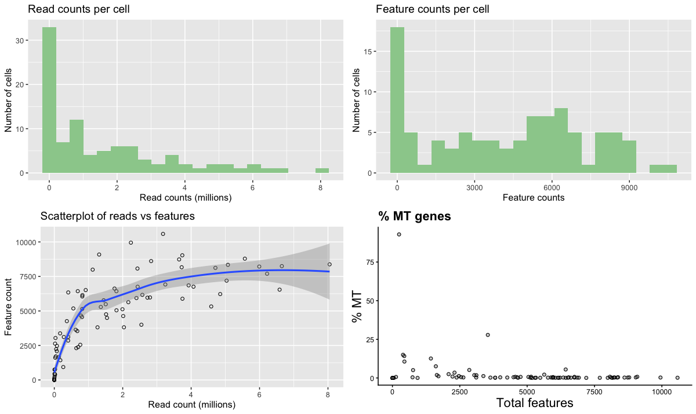

# Expression Matrix Quality Control

## Why QC?
scRNA-seq is a powerful technology for analysing variability in cell populations. However, the combination of technical noise and intrinsic biological variability makes detecting technical artefacts particularly challenging. Removal of low-quality cells and detection of technical artefacts is critical for accurate downstream analysis.

## General process for scRNA-seq QC
Today you will take scRNA-seq data, examine them for low quality cells and filter out these cells leaving you with the best quality data for reliable downstream analysis. You will visualise the data in order to look at library size, number of expressed genes, percentage of mitochondrial gene expression, etc., use different filtering approaches, and look for confounding factors that may affect the interpretation of downstream analyses.

A number of factors should be examined before downstream analyses, many of which we'll address today.

### Low library size
When cells are very degraded or absent from the library preparation, the number of reads sequenced from that library will be very low. It's important to remove these cells from downstream analyses.

### Low number of expressed genes
A low number of expressed genes may be a result of poor-quality cells (e.g. dying, degraded, damaged, etc), followed by high PCR amplification of the remaining RNA. Again, these cells should be removed from downstream analyses.

### High mitochondrial gene content
High concentrations of mitochondrial genes are often a result of damaged cells where the endogenous RNA escapes or degrades. As mitochondria has its own cell membranes, it is often the last DNA/RNA in damaged cells to degrade and hence occurs in high quantities during sequencing.

### Batch effect
Large scRNA-seq projects usually need to generate data across multiple batches due to logistical constraints. However, the processing of different batches is often subject to variation, e.g., changes in operator, differences in reagent quality and concentration, the sequencing machine used, etc. This results in systematic differences in the observed expression in cells from different batches, which we refer to as “batch effects”. Batch effects are problematic as they can be major drivers of variation in the data, masking the relevant biological differences and complicating interpretation of the results.

You will use Galaxy to visualise scRNA-seq data, obtaining information about the factors mentioned above, filter out low-quality cells and confirm that your filtering has worked. You'll then look at confounding factors such as batch effect to see if the data is biased to any technical artifacts. 

## Exercise 3 - Data QC
You will use a pre-calculated expression matrix, created by the same workflow used previously, along with some additional metadata such as lists of control/mitochondrial genes and annotation of technical information for each sequencing library. You will visualise the data and carry out quality control filtering based on what you see in the plots. You will then look for confounding factors in the data.

### Step 1: Loading your data
1. Start a new history, call it 'Single Cell 3' and then navigate your way to Shared Data > Data Libraries > Galaxy Courses > EI Single Cell 2020 >  and enter the 'Single Cell 3' data library. 
2. You will see three datasets:  
	- `expression_matrix.txt`   
 	- `annotation.txt`   
 	- `mt_genes.txt`
3. 	Import all three files as datasets into your history.
4. Take a look at the data.
	
	- You will recognise the `expression_matrix.txt` file. It is a bigger version the 6-sample expression matrix you created earlier. This is a 96-sample expression matrix, coming unsurprisingly from an experiment run with a 96-well plate. Each sample (A1 - H12) is listed as the column headers and the start of each row is an Arabidopsis gene. The rest of the data refers to the number of reads mapped to each gene/sample.  
	- 	The `mt_genes.txt` file is a list of mitochondrial genes. This list will be used later to calculate the % of mitochondrial reads in each sequencing library.  
	- `annotation.txt` is a file listing information about each library, such as the number of cells in each well, the pool number and individual. These will be useful for looking at  batch effects later. 
5. In the tools panel, click in the 'search tools' filed and type 'Scater' and select the 'Scater: Calculate QC metrics' tool. This tool loads all our data and formats it into a form that can be used for our downstream analyses. In the 'Expression matrix in tabular format' select the `expression_matrix.txt` file.
6. In the 'Format dataset describing the features in tabular format' field, select the `annotation.txt` file.
7. Finally, in the 'Dataset containing the list of the mitochondrial control genes' field, select the `mt_genes.txt`.
8. Leave the other fields blank and hit 'Execute'.

The output of this tool is a SingleCellExperiment file, which contains all the information from the input files, along with a host of other quality control metrics, calculated from the input data. 

### Step 2: Visualising your data
Next, lets take a look at the data by plotting various properties to see what our data looks like.

1. Select the on 'Scater: plot library QC' tool. There's only one parameter here, which is the output from the previous step, 'Scater Calculate QC metrics'. Hit 'Execute'.
2. When the tool has finished running, click on the 'eye' icon to view the plots. If it doesn't appear in the browser, try refreshing Galaxy by clicking on the 'Analyse Data' menu and then try again. You may have to download it and view it externally if that doesn't work.
3. You should be presented with plots similar to those below. There are four plots, two distribution bar plots and two scatter plots. The first distribution plot is the number of reads in each library (from a single cell). The second plot is the distribution of 'feature counts' per cell. Feature counts in this case refers to the number of genes expressed in each cell. The third plot 'Scatterplot of reads vs features' is a combination of the two barplots, in that it plots both the read count and the expressed gene count for each cell. The final scatterplot is the '% MT genes', which plots the number of genes expressed verses the percentage of those genes that are mitochondrial genes.
4. Let's look at each plot in turn and see what it tells us.
	- 'Read counts'. You can see that there are a number of cells (45+) that have one million reads or less, with other cells having up to eight million reads. Although one million reads is still quite a lot and we wouldn't want to get rid of so much data, we might want to think about removing cells that only contain a smaller number of reads (say, 100,000).
	- 'Feature counts'. Similar to the read counts plot, we see a high number of cells that have very low number of expressed genes, but followed by a normal-like distribution.
	- 'Scatterplot of reads vs genes'. This takes the information provided in the two distribution plots above and creates a scatterplot from them. The really poor-quality cells are represented by the points near the intersection of the x and y axis, being data with low read count and low gene count. These are the cells we want to remove during filtering.
	- '% MT genes'. You can see that there is one big outlier (>75%), plus a few other cells above 10%.

	

### Filtering your data
In Galaxy there are two filtering tools available. First, there's an 'automatic' filtering tool that uses PCA to identify outliers cells and remove them from the data. Second, there's a manual filtering tool where users can put a range of filtering parameters, informed by the previous plotting tool.

### Step 3: Manual filtering

First, you'll use the filtering tool, 'Scater: filter SCE'. We'll use information from the previous plots to inform the filtering parameters of this tool. Click on the tool and look at what parameters are required. You'll see a number of fields that require values. 

1. The first is the dataset that we want to filter. This will be the `Scater: Calculate QC metrics..` dataset.
2. Next, we want to say if we need a manual or PCA filter. Make sure 'manual' is selected.  
2. Now we want to input our filtering parameters. The first is 'Minimum library size (mapped reads) to filter cells on'. This value asks how many mapped reads from each cell do you require to be mapped to your genome to be included in downstream analysis. We can see from our plots that we have over 30 cells that have less than 250,000 reads. 250,000 is still quite a lot of reads, but we can use a smaller number to see what the initial effect of filtering is. Initially, use 100,000 as the value here.
2. The second field is 'Maximum % of mitochondrial genes expressed per cell'. You can see that as well as having one obvious outlier (>75%), there's also a few other cells that have elevated mitochondrial genes, which occur at over ~15%. Use '15' as the value here.
3. The third parameter is 'Remove cells that have less than the given number of expressed features'. We can see that there is quite a large number of cells that have between 0-1000 'feature counts' in the second chart. Set this to '1000', meaning that we want to filter out cells that have less than 1000 genes 'expressed'.
3. The fourth parameter is 'Number of reads mapped to a feature for it to be counted as expressed'. By default, only one read needs to be mapped to a gene for it to be counted as 'expressed'. We can be a little bit more stringent here and increase the number of reads that need to be mapped to a gene for it to be categorised as 'expressed'. Use '3' as the value here.
4. The final parameter is 'Remove features that occur in less than the given number of cells'. Set this to '1', so that we remove genes expressed as singletons.
4. Hit Execute

The output from this tool will be a SingleCellExperiment file. If you click on the history name, the green history item will expand and you should see a summary of how many cells were filtered out at each step. We can run the same visualisations on this file as we did previously to see what effect our filtering has. Run the 'Scater: plot library QC' tool on your output file and look at the results.  
How did the filtering go? Do you think it's done a good job? Have you removed too many cells? Too few cells? About right? Often, it's a matter of trial and error, where you would start off by being quite lenient (low parameters) and then increasing the stringency until you're happy with the results.

### Step 4: Automatic (PCA) filtering
Another filtering approach is to identify outliers in the data and remove them. PCA can be run once a SingleCellExperiment has been normalised, and outliers cells identified based on the pre-computed quality control metrics within the SingleCellExperiment object.

1. Firstly, we need to do a bit of pre-processing. PCA does not like columns or rows of zeros (this equates to NaN). We need to filter out all cells that have no expressed genes and genes that are not expressed in any cells.
2. We will manually filter these out, using the same process as we did above.
3. First, select the filtering tool, 'Scater: filter SCE'.
1. Again, select the original `Scater: Calculate QC metrics..` dataset and make sure 'manual' is selected.
2. Use the following parameters:
	* 'Minimum library size (mapped reads) to filter cells on': 0 
	* 'Maximum % of mitochondrial genes expressed per cell'. Leave empty
	* 'Remove cells that have less than the given number of expressed features': 1
	* 'Number of reads mapped to a feature for it to be counted as expressed': 0
	* 'Remove features that occur in less than the given number of cells': 0
4. Hit Execute

The output will be a QC metrics file where empty cells or unexpressed genes are removed.

Now, we can use the PCA filter.

1. 	Click on the 'Scater: filter SCE' tool again and load the filtered 'Scater: Calculate QC metrics on data X, Y and Z' file that you just created.   
1. 	Then click on 'Type of filter' and select 'PCA'. All of the other options disappear.   
1. 	Hit Execute.    
1. 	Your data will be normalised and then PCA ran on it using the following information from your data:   

    * `pct_counts_top_100_features`
    * `total_features_by_counts`
    * `pct_counts_feature_control`
    * `total_features_feature_control`
    * `log10_total_counts_endogenous`
    * `log10_total_counts_feature_control`

4. Use the output from 'Scater: PCA filter' to input into the 'Scater: plot library QC'' tool, to examine how the PCA-based filtering method performed.

Compare the output between this and the manual filtering method. How do the two compare?

When using these filtering approaches, it's probably best to use them the opposite way round - try PCA filtering first and then if that doesn't remove enough low-quality cells then use the manual filtering. You could actually pipeline them together - use PCA filtering first, visualise the output, and then use that to do further manual filtering.

### Step 5: Confounder identification
As discussed previously, technical artefacts can bias scRNA-seq analyses. Strong 'batch effects' can mask real biological differences in the data, so must be identified and removed from the data. Logging meta-data details such as date of library construction, sequencing batch, sample name, technical replicate, plate number, etc., is essential to identify batch effects in the data. We can use this information to visualise the data to examine it for clustering according to batch, rather than any real biological feature.

Let's try it with our data

2. Click on the tool 'Scater: PCA plot'.
2. In the 'Input SingleCellExperiment dataset' select either the 'Scater: filter SCE on ..' from the manual or auto (PCR) SCE file that you produced earlier.
3. Next, we're presented with three boxes, asking for annotation features to colour, size and shape the PCA plot with. Take a look at your `annotation.txt` file that you loaded into the history when you started buy clicking on the file name. This will show you the first few lines of it. The column headers of this file is the metadata which you can use in the 'Feature...' fields.
4. We're not blessed with annotation with this dataset, but 'cell_number', 'pool', and 'individual' are all categorical or quantitative, so we can use those to look for batch effects. In the 'Feature to colour..' field type in "individual", for the 'Feature to size..' field type in "cell\_number", and in the 'Feature to shape..' field type in "pool".
5. Hit 'Execute'

Do you see any obvious batch effect? Do any of the pool, individual, or cell_number factors cluster together, suggesting some sort of technical artefact?

## Exercises 4 and 5

In the following exercise you will examine two datasets stored in the Single Cell data library - Single Cell 4 and Single Cell 5. Import the data for each one into separate histories, calculate QC metrics and examine each (by visualising the data using the methods described above). Both of them have something you'd want to address before continuing downstream analyses. It might be some sort of QC problem, technical artifact, or real biological  variation. You will only need to use the Galaxy Scater plotting tools, so don't worry about filtering. What can you find with each dataset?
Hint, for the PCA plots, you can shape, colour, or size your PCA plot points by using only one of the features (leaving the other fields blank). 

